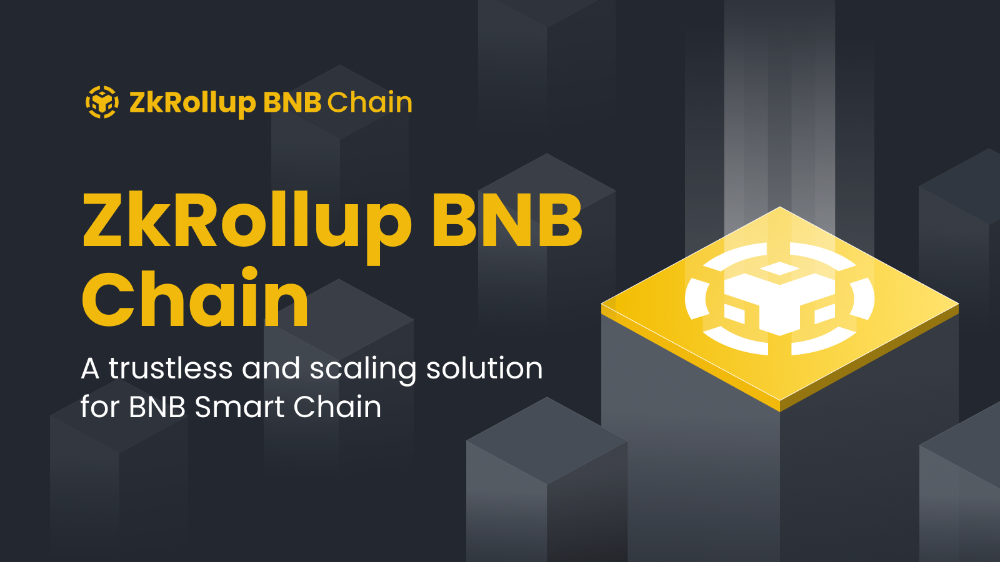
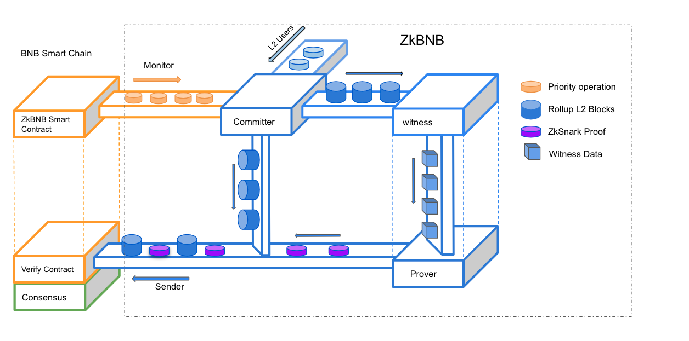
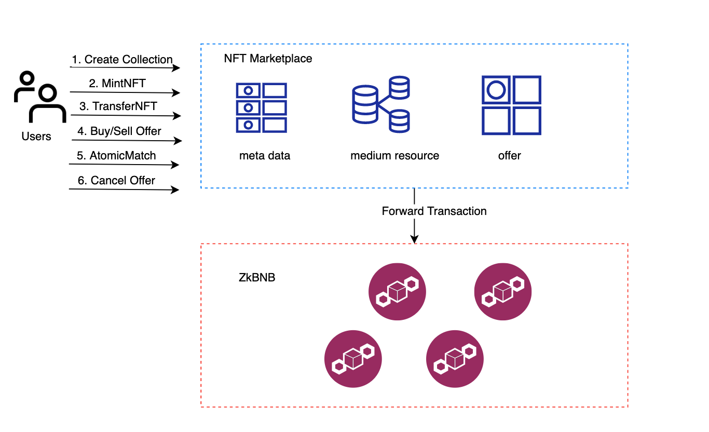

# ZkRollup BNB Application Side Chain




The ZkRollup BNB Application Side Chain(ZkBAS) is an infrastructure for developers that helps them to build large scale 
BSC-based apps with higher throughput and much lower or even zero transaction fees. 

ZkBAS is built on ZK Rollup architecture. ZkBAS bundle (or “roll-up”) hundreds of transactions off-chain and generates 
cryptographic proof. These proofs can come in the form of SNARKs (succinct non-interactive argument of knowledge) which 
can prove the validity of every single transaction in the Rollup Block. It means all funds are held on the BSC, 
while computation and storage are performed on BAS with less cost and fast speed.

ZkBAS achieves the following goals:
- **L1 security**. The ZkBAS share the same security as BSC does. Thanks to zkSNARK proofs, the security is guaranteed by 
  cryptographic. Users do not have to trust any third parties or keep monitoring the Rollup blocks in order to 
  prevent fraud.
- **L1<>L2 Communication**. BNB, and BEP20/BEP721/BEP1155 created on BSC or zkBAS can flow freely between BSC and zkBAS. 
- **Built-in instant AMM swap**. It allows digital assets to be traded without permission and automatically by using 
   liquidity pools.
- **Built-in NFT marketplace**. Developer can build marketplace for crypto collectibles and non-fungible tokens (NFTs) 
  out of box on ZkBAS.
- **Fast transaction speed and faster finality**.
- **Low gas fee**. The gas token on the zkBAS can be either BEP20 or BNB.
- **"Full exit" on BSC**. The user can request this operation to withdraw funds if he thinks that his transactions 
  are censored by zkBAS.

ZkBAS starts its development based on [Zecrey](https://github.com/bnb-chain/zecrey-legend), special thanks to 
[Zecrey](https://www.zecrey.com/) team.

## Framework


- **committer**. Committer executes transactions and produce consecutive blocks.
- **monitor**. Monitor tracks events on BSC, and translates them into **transactions** on zkBAS.
- **witness**. Witness re-executes the transactions within the block and generates witness materials.
- **prover**. Prover generates cryptographic proof based on the witness materials.
- **sender**. The sender rollups the compressed l2 blocks to L1, and submit proof to verify it.
- **api server**. The api server is the access endpoints for most users, it provides rich data, including
  digital assets, blocks, transactions, swap info, gas fees.
- **recovery**. A tool to recover the sparse merkle tree in kv-rocks based on the state world in postgresql.

## Key Features

### Digital Asset Management
The ZkBAS will serve as an alternative marketplace for issuing, using, paying and exchanging digital assets in a 
decentralized manner. ZkBAS and BSC share the same token universe for BNB, BEP2 and NFT tokens. This defines:
- The same token can circulate on both networks, and flow between them bi-directionally via L1 <> L2 communication.
- The total circulation of the same token should be managed across the two networks, i.e. the total effective supply 
  of a token should be the sum of the token's total effective supply on both BSC and BC.
- The tokens can only be initially created on BSC in BEP20, then pegged to the ZkBAS. It is permissionless to peg 
  token onto ZkBAS.

User can **1.deposit 2.transfer 3.withdraw** both non-fungible token and fungible token on ZkBAS.  

Users enter the ZK-rollup by **depositing tokens** in the rollup's contract deployed on the BSC. The ZkBAS monitor 
will track deposits and submit it as a layer2 transaction, once committer verifies the transaction, users get funds on
their account, they can start transacting by sending transactions to the committer for processing.

User can **transfer** any amount of funds to any existed accounts on ZkBAS by sending a signed transaction to the 
network.

**Withdrawing** from ZkBAS to BSC is straightforward. The user initiates the withdrawal transaction, the fund will be 
burned on ZkBAS. Once the transaction in the next batch been rolluped, a related amount of token will be unlocked from 
rollup contract to target account. 

### NFT Management && Marketplace
We target to provide an opensource NFT marketplace for users to browse, buy, sell or create their own NFT. 
The meta-data of NFT on ZkBAS sticks to the [BSC standard](https://docs.bnbchain.org/docs/nft-metadata-standard/).
The ERC721 standard NFT can be seamlessly deposited on ZkBAS, or in reverse. 



Above diagram shows the framework of Nft Marketplace and ZkBAS. All the buy/sell offer, meta-data of NFT/Collection, 
medium resources, account profiles are store in the backend of NFT marketplace, only the **contendHash**,
**ownership**, **creatorTreasuryRate** and few other fields are recorded on ZkBAS. To encourage price discovery, anyone
can place buy/sell offer in the marketplace without paying any fees since the offer is cached in the backend instead of 
being sent to the ZkBAS. Once the offer is matched, an **AtomicMatch** transaction that consist of buy and sell offer 
will be sent to ZkBAS to make the trade happen. Users can also cancel an offer manually by sending a cancel offer 
transaction to disable the backend cached offer.

### AMM Exchange

Automated market makers (AMM) are decentralized exchanges that pool liquidity from users and price the assets within 
the pool using algorithms. 

ZkBAS follows the similar mechanic as [UniSwap V2](https://docs.uniswap.org/protocol/V2/concepts/protocol-overview/how-uniswap-works).
Anyone can become a liquidity provider (LP) for a pool by depositing an equivalent value of each underlying token in 
return for pool tokens. The different from UniSwap is that the LP token on ZkBAS can not transfer or trade. Users can
simply list a swap pair by calling the rollup contract on BSC.

### Native Name Service
No more copying and pasting long addresses on ZkBAS. Every account on ZkBAS gets its short name, user can use that to 
store funds and receive any cryptocurrency, token, or NFT. 

### Seamless L1 Wallet Management
ZkBAS natively supports ECDSA signatures and follows [EIP712](https://github.com/ethereum/EIPs/blob/master/EIPS/eip-712.md)
signing structure, which means most of the Ethereum wallets can seamless support ZkBAS. There is no extra effort for BSC
users to leverage ZkBAS.

## Key Tech

### Sparse Merkle Tree K-V Store 
Unlike most rollup solution to put the state tree in memory, [BAS-SMT](https://github.com/bnb-chain/bas-smt/) is a versioned, 
snapshottable (immutable) sparse tree for persistent data. BAS-SMT is the key factor for the massive adoption of ZkBAS.

### Circuit Model
[ZkBAS Crypto](https://github.com/bnb-chain/zkbas-crypto) is the library that describe the proving circuit. Once 
the ZK-rollup node has enough transactions, it aggregates them into a batch and compiles inputs for the proving circuit 
to compile into a succinct zk-proof.


## Building from Source

1. Install necessary tools before building, and this only need to executed by once.
```shell
make tools
```

2. Build the binary.
```shell
make build
```

## Dev Network Setup
We are preparing to set up the whole system using docker composer, it is coming soon..

## Testnet(coming soon)

## Contribution
Thank you for considering to help out with the source code! We welcome contributions from anyone on the internet, 
and are grateful for even the smallest of fixes!

If you'd like to contribute to bsc, please fork, fix, commit and send a pull request for the maintainers to review 
and merge into the main code base. If you wish to submit more complex changes though, Start by browsing 
[new issues](https://github.com/bnb-chain/zkbas/issues) and [BEPs](https://github.com/bnb-chain/BEPs). 
If you are looking for something interesting or if you have something in your mind, there is a chance it had been discussed.

## Related Projects

- [ZkBAS Rollup Contracts](https://github.com/bnb-chain/zkbas-contract).
- [ZkBAS Crypto](https://github.com/bnb-chain/zkbas-crypto).
- [ZkBAS Eth RPC](https://github.com/bnb-chain/zkbas-eth-rpc).
- [ZkBAS Go SDK](https://github.com/bnb-chain/zkbas-go-sdk).

## Outlook
We believe that zk-Rollup Sooner or later L2 The best of the track — This is a very cheap and safe first-class 
L2 Expansion solutions. However, ZkBAS is application specific so far, this makes it difficult for developers to 
build custom dApp on that, we will introduce generic programmability in the future... 


