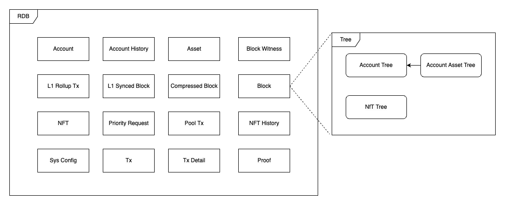
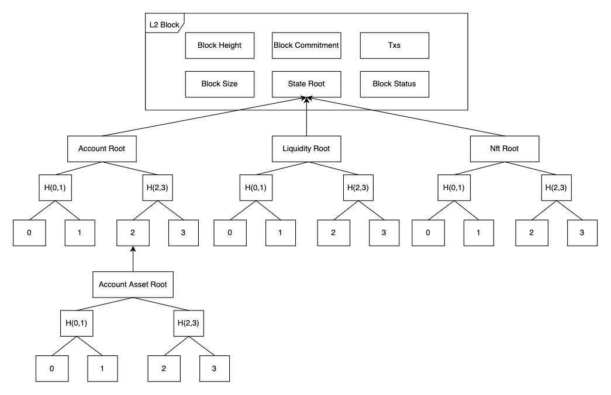

# Storage Layout

## Table
 - `Account`: record account related information
 - `Account History`: record the historical change information of the account
 - `Asset`: record Asset related information
 - `Block Witness`: record the information about the generated Witness
 - `L1 Rollup Tx`: record transaction information from L1
 - `L1 Synced Block`: record block information from L1
 - `Compressed Block`: record other information of L2 block
 - `Block`: record L2 block information
 - `Liquidity`: record Liquidity related information
 - `Liquidity History`: record the historical change information of Liquidity
 - `Pool Tx`: record pending and executed but not packed Tx messages
 - `L2 NFT`: record NFT related information
 - `L2 NFT History`: record the historical status change information of NFT
 - `Priority Request`: record Priority Request information from L1
 - `Proof`: record the Proof information generated by the circuit
 - `Sys Config`: store system variables
 - `Tx`: record transaction information on L2
 - `Tx Detail`: record detailed transaction information on L2

## Tree
There are 4 types of trees in the system.
 - Account Tree
 - Account Asset Tree
 - Liquidity Tree 
 - Nft Tree

## Account Tree
The `AccountNameHash`, `PublicKey`, `Nonce`, `CollectionNonce`, `AccountAssetTree.Root()` of each Account will be calculated as a hash and written into the tree corresponding to the `AccountID`. 
Used to record and save account status under each block height.

## Account Asset Tree
Each Account will maintain an Asset tree, the `Balance`, `LpAmount`, and `OfferCanceledOrFinalized` of each Asset will be calculated as a hash and written into the tree corresponding to the `AssetID`.

## Liquidity Tree
The `AssetAId`, `AssetA`, `AssetBId`, `AssetB`, `LpAmount`, `KLast`, `FeeRate`, `TreasuryAccountIndex`, and `TreasuryRate` of each liquidity resource will be calculated as a hash and written into the tree corresponding to the `PairIndex`. 
Used to record and save liquidity status under each block height.

## Nft Tree
The `CreatorAccountIndex`, `OwnerAccountIndex`, `NftContentHash`, `NftL1Address`, `NftL1TokenId`, `CreatorTreasuryRate`, and `CollectionId` of each nft resource will be calculated as a hash and written into the tree corresponding to the `NftIndex`. 
Used to record and save nft status under each block height.

## Physical Storage
The Tree in `ZkBNB` uses the Sparse Merkle Tree (SMT) structure. In order to optimize the storage space as much as possible, we have implemented a SMT library, compressing the four-layer tree structure into one layer, reducing the depth of the tree and achieving a higher level. storage space usage.

Find More: https://github.com/bnb-chain/zkbnb-smt/blob/main/docs/design.md