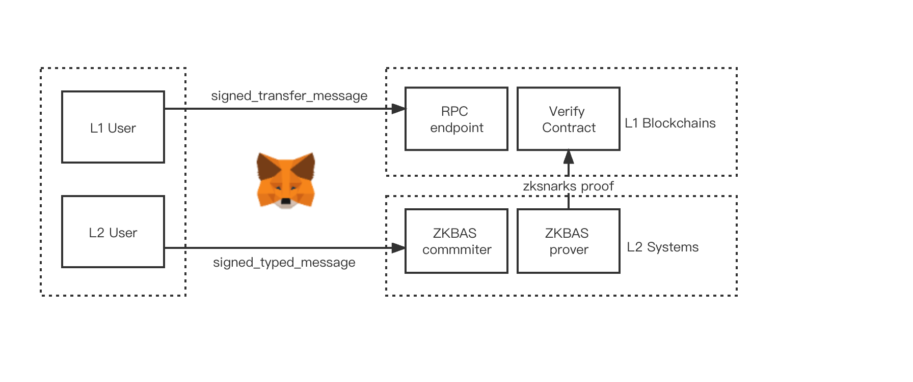
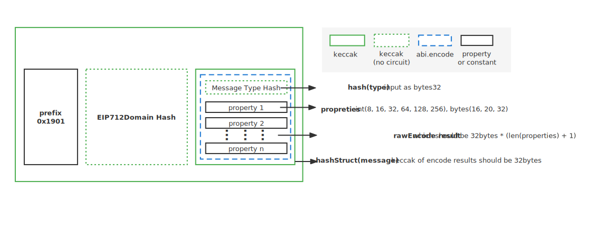

# ZkBNB Wallets

## L1 Wallet Support Introduction

ZkBNB is built on ZK Rollup architecture.
ZkBNB bundle (or “roll-up”) hundreds of transactions off-chain and generates cryptographic proof.

For convenience of user, ZkBNB implemented new version supporting L1 wallets by taking advantages of
EIP-712 standard signature which is able to sign any structured message and supported well by the mainstream wallets. (f.g. metamask, trust wallet, etc.)

Any user can be accessible to ZkBNB only if the user gets wallet apps which support the EIP-712 signing scheme, and any user can easily manage their L2 assets(NFT, Tokens, etc.)
by importing the ecdsa(secp256k1) private key to their wallets mentioned above.

**NOTE: this feature is still on development**



## EIP-712 Standard Adaptation

[EIP-712](https://eips.ethereum.org/EIPS/eip-712) is a standard for hashing and signing of typed structured data as opposed to just bytestrings. It includes a

* theoretical framework for correctness of encoding functions,
* specification of structured data similar to and compatible with Solidity structs,
* safe hashing algorithm for instances of those structures,
* safe inclusion of those instances in the set of signable messages,
* an extensible mechanism for domain separation,
* new RPC call eth_signTypedData, and
* an optimized implementation of the hashing algorithm in EVM.

### Brief View of EIP-712 Implementation

EIP-712 standard is implemented as below



Below is the encode and sign flow from bottom to top.

1. hash of message type, we call it **hash(type)**
2. rawEncode of hash(type) and message entity properties, we call it **rawEncode result**. rawEncode result is rawEncode(hash(type), properties...)
3. hash of rawEncode result, we call it **hashStruct(message)**
4. same structure as hashStruct(message) for the EIP712Domain hashStruct, we call it **hashStruct(EIP712Domain)**
5. concat bytes of prefix, hashStruct(EIP712Domain), hashStruct(message), we call them **bytesConcat**.
6. hash of bytesConcat, we call it **hash(bytesConcat)**
7. sign the hash(bytesConcat) using the privateKey, and generate final ecdsa signature based on curve secp256k1.

### Elliptic Curve Adaptation

For an adaptation of EIP-712 standard signing scheme, ZkBNB switch ecc signature algorithm's elliptic curve from original eddsa to ecdsa, precisely secp256k1 which
is used across EVM-based blockchain. 

Moreover, in order to support ecdsa change ZkBNB switch the zksnarks proving system from groth16 to plonk, so the contract verifier switch from groth16 verifier contract to plonk verifier contract.

*This feature is still on develop phase, and will support soon.*

### Hash Function Adaptation

For an adaptation of EIP-712 standard signing scheme, ZkBNB switch hash algorithm from originally MIMC to Keccak256(SHA-3).

The keccak256 in Circuit is still in hint scope for the complexity of keccak functions, which pure implementation by circuit will add constraints more than **200K**.

*Trick here: as we can see from [Brief View of EIP-712 Implementation](#brief-view-of-eip-712-implementation), the hash results of hashStruct(eip712domain) and hash(type) will be skipped in circuit by using a constant value, which can significantly reduce keccaks times*

*f.g. we define prefix + hashStruct(EIP712Domain) in code as below:*
```golang=
var HexPrefixAndEip712DomainKeccakHash = "1901b4c86e5ff1abb2a7aae82a5ced0f0733dfd26fbef5c4713bfbf42d46a73e21c4"
```
*f.g. we definae hash(type) for transfer as below*
```golang=
HexEIP712MessageTypeHash[Transfer] = "96695797a85b65c62a1eb8e28852fc7d5a34b668e127752d9a132d6d5e2d3717"
```

### Encodes Adaptation

For an adaptation of EIP-712 standard signing scheme, ZkBNB switch encodes of transaction from originally joining all bytes to
EIP-712 signed typed message encoding, as described at [Brief View of EIP-712 Implementation](#brief-view-of-eip-712-implementation).

Basically the encode switched to a
non-standard abi.encode function, while use the type hash as the fist input and properties of transactions as others, and called as a constructor abi.encode for each transaction.
See more about abi.encode [here](https://docs.soliditylang.org/en/v0.8.15/abi-spec.html).

And the message of every transaction is described in [Transactions Type Definition](#typed-message-definition-of-all-transactions).
The abi.encode in Circuit is still in hint scope.

## Typed Message Signature

Below is the typescript definition of TypedMessage. The TypedMessage use types as types definition, and primaryType as the selected encode types, and message as the values to be signed, the domain here is EIP712Domain.

```typescript=
/**
* This is the message format used for `signTypeData`, for all versions
* except `V1`.
*
* @template T - The custom types used by this message.
* @property types - The custom types used by this message.
* @property primaryType - The type of the message.
* @property domain - Signing domain metadata. The signing domain is the intended context for the
* signature (e.g. the dapp, protocol, etc. that it's intended for). This data is used to
* construct the domain seperator of the message.
* @property domain.name - The name of the signing domain.
* @property domain.version - The current major version of the signing domain.
* @property domain.chainId - The chain ID of the signing domain.
* @property domain.verifyingContract - The address of the contract that can verify the signature.
* @property domain.salt - A disambiguating salt for the protocol.
* @property message - The message to be signed.
*/
export interface TypedMessage<T extends MessageTypes> {
   types: T;
   primaryType: keyof T;
   domain: {
       name?: string;
       version?: string;
       chainId?: number;
       verifyingContract?: string;
       salt?: ArrayBuffer;
   };
   message: Record<string, unknown>;
}
```

### Typed Message Definition of All Transactions

Below is the typescript definition of transaction and EIP712Domain. These typed message can be used in all wallets that support EIP-712 sign scheme and thus generate the signature ready for L2 verification and execution, finally rollup proof generation.

#### EIP712Domain
```typescript=
    const types = {
        EIP712Domain: [
            { name: 'name', type: 'string' },
            { name: 'version', type: 'string' },
            { name: 'chainId', type: 'uint256' },
            { name: 'verifyingContract', type: 'address' },
            { name: 'salt', type: 'bytes32' },
        ],
```        

#### EIP712Domain Static Value
```typescript=
    const salt = Buffer.from(
        '0xf2d857f4a3edcb9b78b4d503bfe733db1e3f6cdc2b7971ee739626c97e86a558',
        'hex',
    );
    const domain = {
        name: 'ZkBNB',
        version: '1.0',
        chainId: 10,
        verifyingContract: '',
        salt: salt,
    };    
```        

#### Message
##### Transfer
```typescript=
        Transfer: [
            { name: 'FromAccountIndex', type: 'uint256' },
            { name: 'ToAccountIndex', type: 'uint256' },
            { name: 'ToAccountNameHash', type: 'bytes32' },
            { name: 'AssetId', type: 'uint256' },
            { name: 'packedAmount', type: 'uint256' },
            { name: 'GasAccountIndex', type: 'uint256' },
            { name: 'GasFeeAssetId', type: 'uint256' },
            { name: 'packedFee', type: 'uint256' },
            { name: 'CallDataHash', type: 'bytes32' },
            { name: 'ExpiredAt', type: 'uint256' },
            { name: 'Nonce', type: 'uint256' },
            { name: 'ChainId', type: 'uint256' },
        ],
```
##### Withdraw
```typescript=
        Withdraw: [
            { name: 'FromAccountIndex', type: 'uint256' },
            { name: 'AssetId', type: 'uint256' },
            { name: 'AssetAmount', type: 'bytes16' },
            { name: 'GasAccountIndex', type: 'uint256' },
            { name: 'GasFeeAssetId', type: 'uint256' },
            { name: 'GasFeeAssetAmount', type: 'uint256' },
            { name: 'ToAddress', type: 'bytes20' },
            { name: 'ExpiredAt', type: 'uint256' },
            { name: 'Nonce', type: 'uint256' },
            { name: 'ChainId', type: 'uint256' },
        ],
```       
##### AddLiquidity
```typescript=
        AddLiquidity: [
            { name: 'FromAccountIndex', type: 'uint256' },
            { name: 'PairIndex', type: 'uint256' },
            { name: 'AssetAAmount', type: 'uint256' },
            { name: 'AssetBAmount', type: 'uint256' },
            { name: 'GasAccountIndex', type: 'uint256' },
            { name: 'GasFeeAssetId', type: 'uint256' },
            { name: 'GasFeeAssetAmount', type: 'uint256' },
            { name: 'ExpiredAt', type: 'uint256' },
            { name: 'Nonce', type: 'uint256' },
            { name: 'ChainId', type: 'uint256' },
        ],
```        
##### RemoveLiquidity
```typescript=
        RemoveLiquidity: [
            { name: 'FromAccountIndex', type: 'uint256' },
            { name: 'PairIndex', type: 'uint256' },
            { name: 'AssetAMinAmount', type: 'uint256' },
            { name: 'AssetBMinAmount', type: 'uint256' },
            { name: 'LpAmount', type: 'uint256' },
            { name: 'GasAccountIndex', type: 'uint256' },
            { name: 'GasFeeAssetId', type: 'uint256' },
            { name: 'GasFeeAssetAmount', type: 'uint256' },
            { name: 'ExpiredAt', type: 'uint256' },
            { name: 'Nonce', type: 'uint256' },
            { name: 'ChainId', type: 'uint256' },
        ],
```        
##### Swap
```typescript=
        Swap: [
            { name: 'FromAccountIndex', type: 'uint256' },
            { name: 'PairIndex', type: 'uint256' },
            { name: 'AssetAAmount', type: 'uint256' },
            { name: 'AssetBMinAmount', type: 'uint256' },
            { name: 'GasAccountIndex', type: 'uint256' },
            { name: 'GasFeeAssetId', type: 'uint256' },
            { name: 'GasFeeAssetAmount', type: 'uint256' },
            { name: 'ExpiredAt', type: 'uint256' },
            { name: 'Nonce', type: 'uint256' },
            { name: 'ChainId', type: 'uint256' },
        ],
```        
##### CreateCollection
```typescript=
        CreateCollection: [
            { name: 'AccountIndex', type: 'uint256' },
            { name: 'GasAccountIndex', type: 'uint256' },
            { name: 'GasFeeAssetId', type: 'uint256' },
            { name: 'GasFeeAssetAmount', type: 'uint256' },
            { name: 'ExpiredAt', type: 'uint256' },
            { name: 'Nonce', type: 'uint256' },
            { name: 'ChainId', type: 'uint256' },
        ],
```        
##### MintNft
```typescript=
        MintNft: [
            { name: 'CreatorAccountIndex', type: 'uint256' },
            { name: 'ToAccountIndex', type: 'uint256' },
            { name: 'ToAccountNameHash', type: 'bytes32' },
            { name: 'NftContentHash', type: 'bytes32' },
            { name: 'GasAccountIndex', type: 'uint256' },
            { name: 'GasFeeAssetId', type: 'uint256' },
            { name: 'GasFeeAssetAmount', type: 'uint256' },
            { name: 'CreatorTreasuryRate', type: 'uint256' },
            { name: 'NftCollectionId', type: 'uint256' },
            { name: 'ExpiredAt', type: 'uint256' },
            { name: 'Nonce', type: 'uint256' },
            { name: 'ChainId', type: 'uint256' },
        ],
```        
##### TransferNft
```typescript=
        TransferNft: [
            { name: 'FromAccountIndex', type: 'uint256' },
            { name: 'ToAccountIndex', type: 'uint256' },
            { name: 'ToAccountNameHash', type: 'bytes32' },
            { name: 'NftIndex', type: 'uint256' },
            { name: 'GasAccountIndex', type: 'uint256' },
            { name: 'GasFeeAssetId', type: 'uint256' },
            { name: 'GasFeeAssetAmount', type: 'uint256' },
            { name: 'CallDataHash', type: 'bytes32' },
            { name: 'ExpiredAt', type: 'uint256' },
            { name: 'Nonce', type: 'uint256' },
            { name: 'ChainId', type: 'uint256' },
        ],
```        
##### WithdrawNft
```typescript=
        WithdrawNft: [
            { name: 'AccountIndex', type: 'uint256' },
            { name: 'NftIndex', type: 'uint256' },
            { name: 'ToAddress', type: 'bytes20' },
            { name: 'GasAccountIndex', type: 'uint256' },
            { name: 'GasFeeAssetId', type: 'uint256' },
            { name: 'GasFeeAssetAmount', type: 'uint256' },
            { name: 'ExpiredAt', type: 'uint256' },
            { name: 'Nonce', type: 'uint256' },
            { name: 'ChainId', type: 'uint256' },
        ],
```        
##### CancelOffer
```typescript=
        CancelOffer: [
            { name: 'AccountIndex', type: 'uint256' },
            { name: 'OfferId', type: 'uint256' },
            { name: 'GasAccountIndex', type: 'uint256' },
            { name: 'GasFeeAssetId', type: 'uint256' },
            { name: 'GasFeeAssetAmount', type: 'uint256' },
            { name: 'ExpiredAt', type: 'uint256' },
            { name: 'Nonce', type: 'uint256' },
            { name: 'ChainId', type: 'uint256' },
        ],
```     
##### AtomicMatch
```typescript=
        AtomicMatch: [
            { name: 'sellerAccountIndex', type: 'uint256' },
            { name: 'sellerNftIndex', type: 'uint256' },
            { name: 'sellerOfferId', type: 'uint256' },
            { name: 'sellerType', type: 'uint256' },
            { name: 'sellerAssetId', type: 'uint256' },
            { name: 'sellerAssetAmount', type: 'uint256' },
            { name: 'sellerListedAt', type: 'uint256' },
            { name: 'sellerExpiredAt', type: 'uint256' },
            { name: 'sellerTreasureRate', type: 'uint256' },
            { name: 'sellerSigR', type: 'bytes32' },
            { name: 'sellerSigS', type: 'bytes32' },
            { name: 'buyerAccountIndex', type: 'uint256' },
            { name: 'buyerNftIndex', type: 'uint256' },
            { name: 'buyerOfferId', type: 'uint256' },
            { name: 'buyerType', type: 'uint256' },
            { name: 'buyerAssetId', type: 'uint256' },
            { name: 'buyerAssetAmount', type: 'uint256' },
            { name: 'buyerListedAt', type: 'uint256' },
            { name: 'buyerExpiredAt', type: 'uint256' },
            { name: 'buyerTreasureRate', type: 'uint256' },
            { name: 'buyerSigR', type: 'bytes32' },
            { name: 'buyerSigS', type: 'bytes32' },
            { name: 'Nonce', type: 'uint256' },
            { name: 'ChainId', type: 'uint256' },
        ],
    };
```